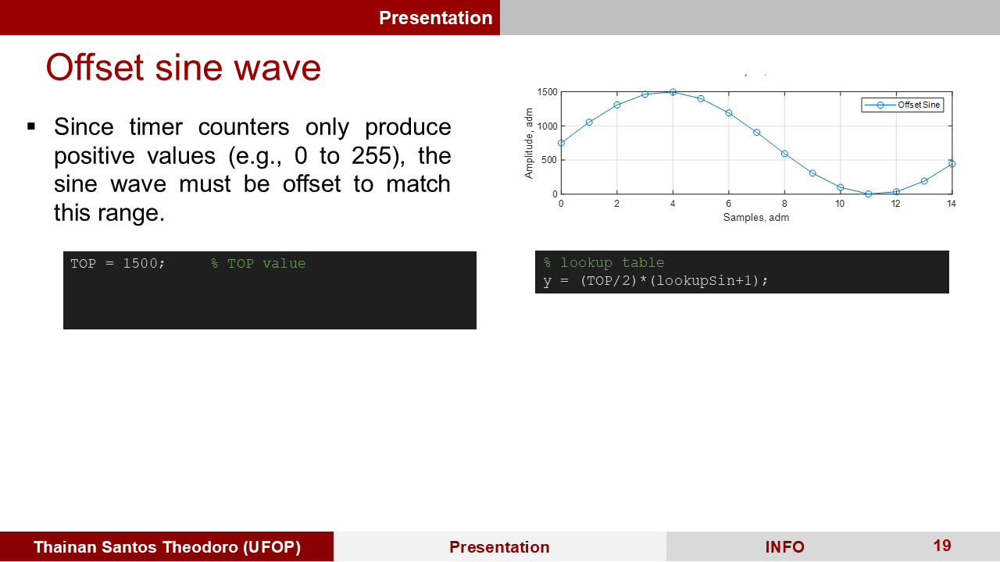

# Sinusoidal PWM with AVR (ATmega328P)

## Overview

This code implements a **sinusoidally modulated PWM generator** using **Timer1** on an **AVR microcontroller** (ATmega328P, as used in the Arduino Uno).  
Sinusoidal modulation is commonly used to control loads such as **inverters, motors, and power converters**.

## How It Works

1. **Parameter Calculation**
   - The carrier frequency (`fpwm_target`) is derived from the reference sine frequency `fo = 60 Hz` and the modulation factor `mf = 200`:
     ```c
     fpwm_target = mf * fo = 200 * 60 = 12 kHz
     ```
   - The **TOP** value for Timer1 is calculated to match the desired PWM frequency:
     ```c
     TOP = ceil(ftimer / fpwm_target - 1);
     ```

2. **Sine Lookup Table**
   - A `lookupSin` table stores precomputed normalized sine wave values.
   - In **bipolar mode**, both OC1A and OC1B follow the same sine wave.
   - In **unipolar mode**, OC1A and OC1B are phase-shifted by 180°.

3. **Timer1 Configuration**
   - **Fast PWM (Mode 14, ICR1 as TOP)**
   - **Prescaler = 1** for higher resolution
   - **Interrupt enabled** to update PWM on every cycle

4. **Timer1 Interrupt**
   - On overflow, the `isInterrupt` flag is set to `true`.
   - The main `loop()` uses this flag to update the PWM values from `lookupSin`.

## Code Structure

### **Main Variables**
```c
const double fo = 60.0;
const double mf = 200.0;
const double fclk = 16e6;
const int N = 1;
```
- `fo`: Sine reference frequency (60 Hz)
- `mf`: Modulation factor (carrier = 200 × `fo`)
- `fclk`: Microcontroller clock (16 MHz)
- `N`: Prescaler (set to 1)

### **Key Functions**
- `setup()`: Configures PWM and interrupts
- `loop()`: Updates `OCR1A` and `OCR1B` using the sine lookup table
- `ISR(TIMER1_OVF_vect)`: Sets flag to trigger PWM update
- `generateLookupTable()`: Generates sine samples
- `setPrescaler()`, `setWaveformGenerationMode()`, `setPWMPinMode()`: Timer1 configuration utilities

## How to Run

1. **Upload the code** to an **Arduino Uno** or compatible AVR microcontroller.
2. **Observe pins 9 (OC1A) and 10 (OC1B)** with an oscilloscope to visualize the PWM waveform.
3. **Adjust `ma` (sine amplitude) and `mf` (modulation factor)** as needed.

## Future Improvements

- **Store lookup table in Flash (`PROGMEM`)** to reduce RAM usage.
- **Implement sample spacing with compare match interrupts** for better timing accuracy.
- **Add dynamic amplitude control** for real-time waveform modulation.

# Arduino PWM – Slides

This repository contains the full slide deck for the presentation on **Sinusoidal PWM using Timer1 on Arduino**.

The slides cover:
- H-bridge inverter structure
- Unipolar and bipolar PWM generation
- Timer1 configuration
- Use of lookup tables for sine generation
- Interrupt handling and register configuration

Below are the slides in order, from Slide 1 to Slide 44.

---
### Slide 1


### Slide 2


### Slide 3


### Slide 4


### Slide 5


### Slide 6


### Slide 7


### Slide 8


### Slide 9


### Slide 10


### Slide 11


### Slide 12


### Slide 13


### Slide 14


### Slide 15


### Slide 16


### Slide 17


### Slide 18


### Slide 19



### Slide 20


### Slide 21


### Slide 22


### Slide 23


### Slide 24


### Slide 25


### Slide 26


### Slide 27


### Slide 28


### Slide 29


### Slide 30


### Slide 31


### Slide 32


### Slide 33


### Slide 34


### Slide 35


### Slide 36


### Slide 37


### Slide 38


### Slide 39


### Slide 40


### Slide 41


### Slide 42


### Slide 43


### Slide 44

